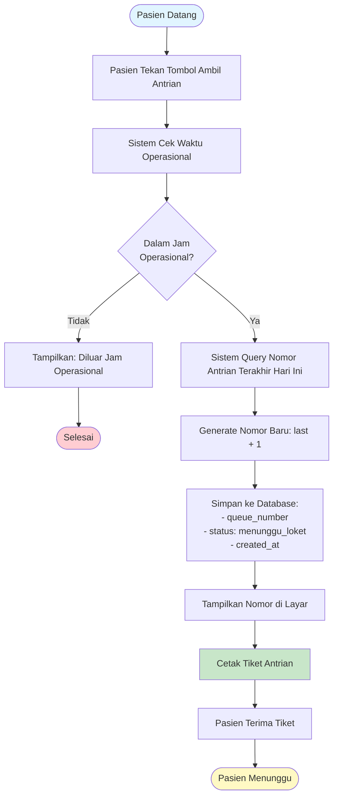
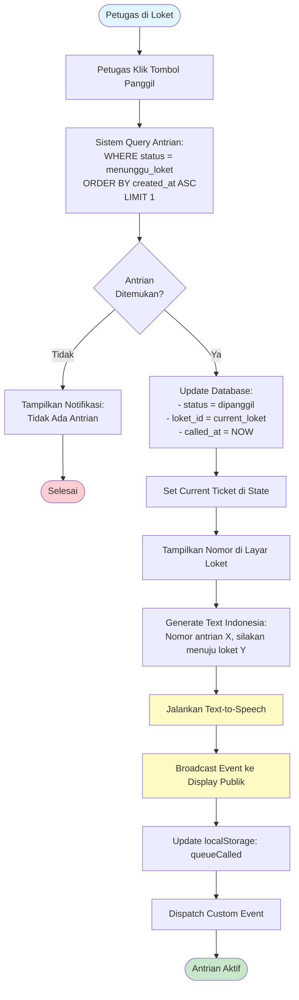
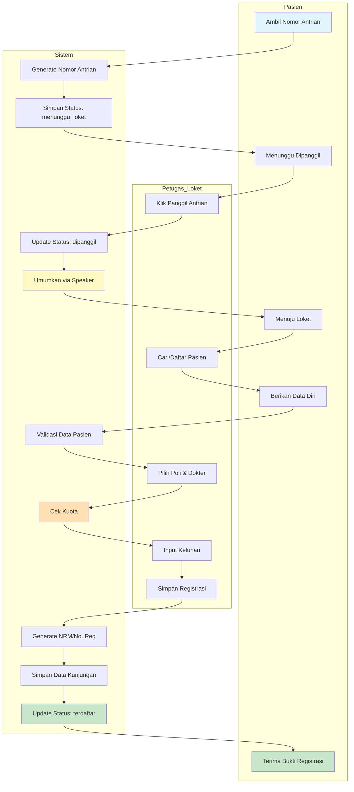
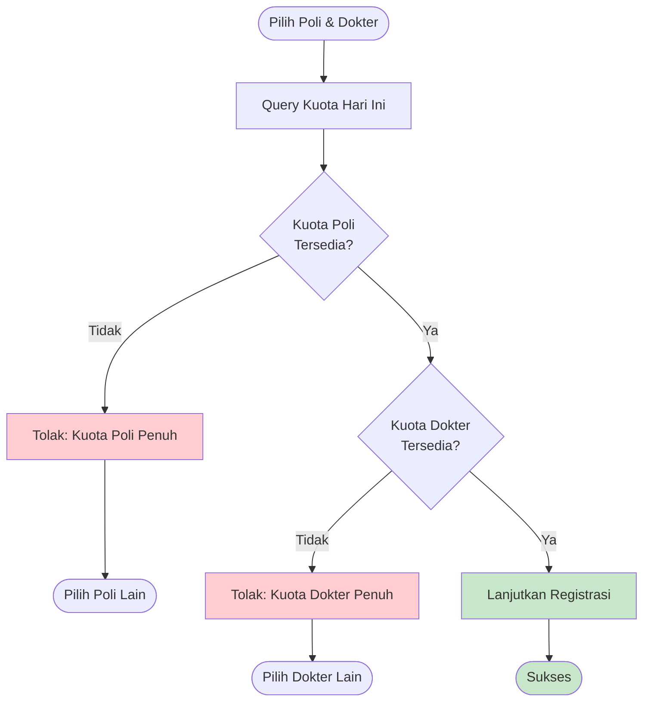
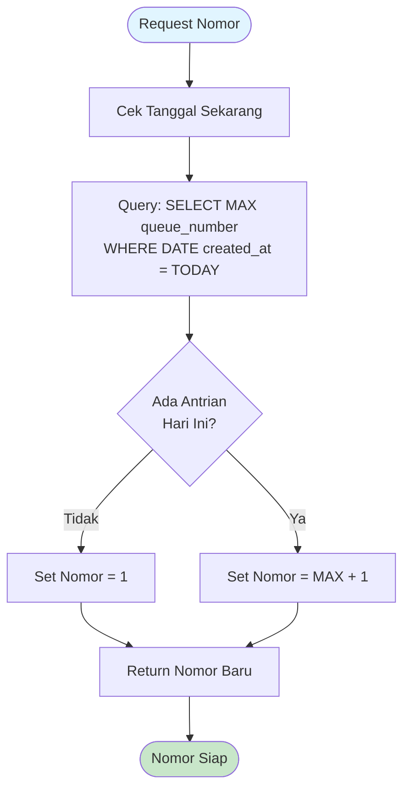
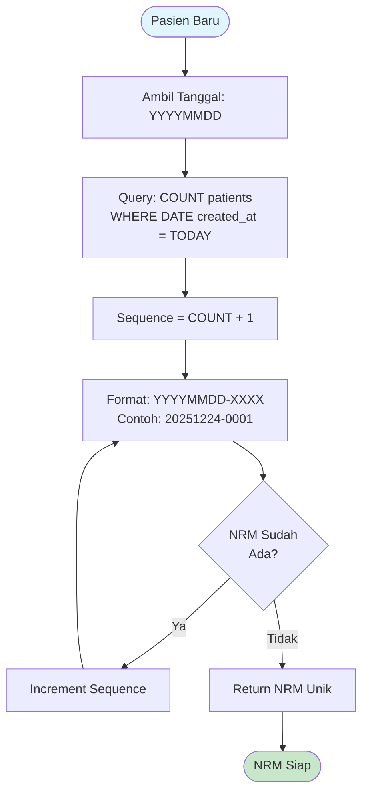
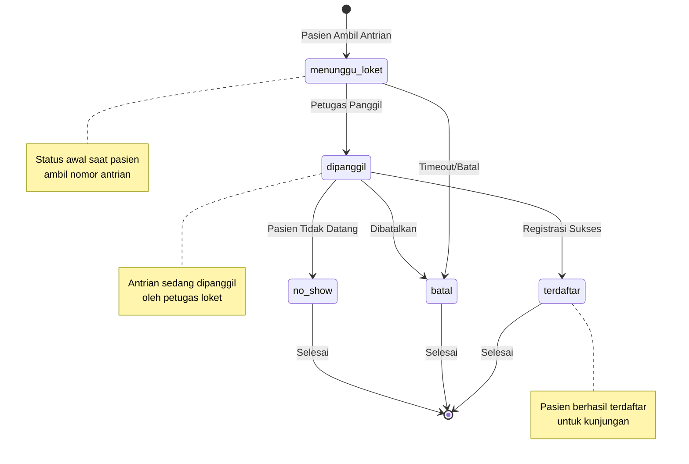
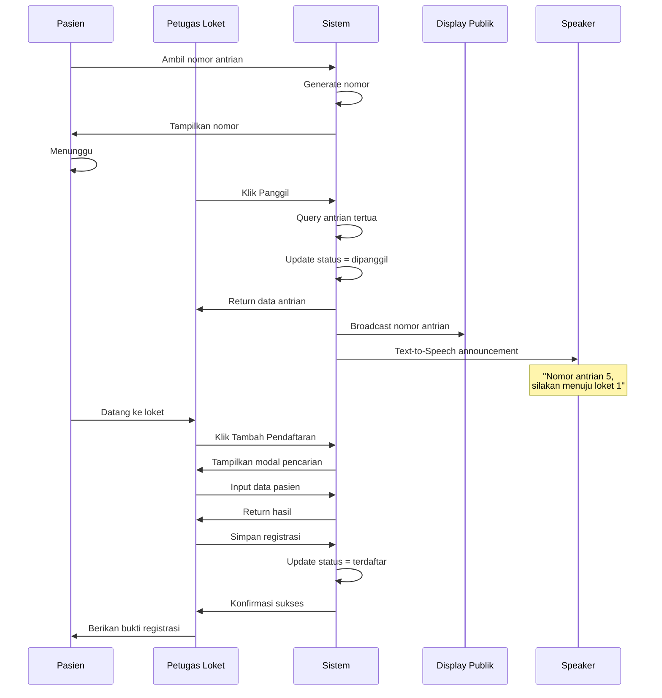

# Activity Diagram - Sistem Antrian dan Loket SIMRS

## Overview

Activity diagram ini menggambarkan alur proses lengkap dari sistem antrian dan loket, mulai dari pasien mengambil nomor antrian hingga registrasi kunjungan selesai.

---

## 1. Activity Diagram - Alur Lengkap (End-to-End)

```mermaid
flowchart TD
    Start([Pasien Datang ke RS]) --> A1[Pasien Ambil Nomor Antrian]
    A1 --> A2[Sistem Generate Nomor Antrian]
    A2 --> A3[Sistem Simpan dengan Status: menunggu_loket]
    A3 --> A4[Pasien Menunggu Dipanggil]
    
    A4 --> B1{Petugas Loket<br/>Klik Panggil?}
    B1 -->|Ya| B2[Sistem Ambil Antrian Tertua]
    B2 --> B3{Ada Antrian<br/>Menunggu?}
    
    B3 -->|Tidak| B4[Tampilkan: Tidak Ada Antrian]
    B4 --> B1
    
    B3 -->|Ya| B5[Update Status: dipanggil]
    B5 --> B6[Tampilkan Nomor di Layar Loket]
    B6 --> B7[Umumkan via Speaker TTS]
    B7 --> B8[Pasien Menuju Loket]
    
    B8 --> C1[Petugas Klik: Tambah Pendaftaran]
    C1 --> C2[Tampilkan Modal Pencarian Pasien]
    C2 --> C3[Petugas Input Kriteria Pencarian]
    C3 --> C4{Pasien<br/>Ditemukan?}
    
    C4 -->|Ya| C5[Pilih Pasien dari Hasil]
    C5 --> D1[Tampilkan Modal Registrasi Kunjungan]
    
    C4 -->|Tidak| C6[Klik: Buat Pasien Baru]
    C6 --> C7[Redirect ke Form Pasien Baru]
    C7 --> C8[Input Data Pasien Lengkap]
    C8 --> C9{Data<br/>Valid?}
    
    C9 -->|Tidak| C10[Tampilkan Error]
    C10 --> C8
    
    C9 -->|Ya| C11[Generate NRM Unik]
    C11 --> C12[Simpan Data Pasien]
    C12 --> C13[Redirect Kembali ke Loket]
    C13 --> D1
    
    D1 --> D2[Tampilkan Data Pasien]
    D2 --> D3[Hitung Kunjungan Ke-]
    D3 --> D4[Petugas Pilih Poliklinik]
    D4 --> D5[Filter Dokter Sesuai Poli]
    D5 --> D6[Petugas Pilih Dokter]
    D6 --> D7{Cek Kuota<br/>Poli & Dokter}
    
    D7 -->|Penuh| D8[Tampilkan: Kuota Penuh]
    D8 --> D4
    
    D7 -->|Tersedia| D9[Petugas Pilih Cara Bayar]
    D9 --> D10[Petugas Input Keluhan]
    D10 --> D11[Sistem Hitung Harga]
    D11 --> D12[Petugas Klik Simpan]
    D12 --> D13{Data<br/>Lengkap?}
    
    D13 -->|Tidak| D14[Tampilkan Error]
    D14 --> D4
    
    D13 -->|Ya| D15[Generate Nomor Registrasi]
    D15 --> D16[Simpan Data Kunjungan]
    D16 --> D17[Update Status Antrian: terdaftar]
    D17 --> D18[Tampilkan Pesan Sukses]
    D18 --> D19[Cetak/Tampilkan Bukti Registrasi]
    D19 --> End([Selesai])
    
    style Start fill:#e1f5ff
    style End fill:#c8e6c9
    style B4 fill:#ffcdd2
    style D8 fill:#ffcdd2
    style C10 fill:#ffcdd2
    style D14 fill:#ffcdd2
    style D19 fill:#c8e6c9
```

---

## 2. Activity Diagram - Proses Ambil Antrian

---

## 3. Activity Diagram - Proses Panggil Antrian

---

## 4. Activity Diagram - Proses Registrasi Kunjungan

```mermaid
flowchart TD
    Start([Pasien di Loket]) --> C1{Pasien Sudah<br/>Terdaftar?}
    
    C1 -->|Ya| C2[Buka Modal Pencarian]
    C2 --> C3[Input NRM/Nama/NIK]
    C3 --> C4[Sistem Search Database]
    C4 --> C5[Tampilkan Hasil]
    C5 --> C6[Pilih Pasien]
    C6 --> D1[Buka Modal Registrasi]
    
    C1 -->|Tidak| C7[Buka Form Pasien Baru]
    C7 --> C8[Input Data Personal:<br/>- Nama, NIK, TTL, JK]
    C8 --> C9[Input Data Penanggung Jawab]
    C9 --> C10[Input Alamat Lengkap]
    C10 --> C11[Pilih Penjamin Default]
    C11 --> C12{Validasi<br/>Data}
    
    C12 -->|Gagal| C13[Tampilkan Error]
    C13 --> C8
    
    C12 -->|Sukses| C14[Generate NRM:<br/>Format: YYYYMMDD-XXXX]
    C14 --> C15[Simpan ke Table: patients]
    C15 --> C16[Simpan ke Table: patient_penjamin]
    C16 --> D1
    
    D1 --> D2[Load Data Pasien]
    D2 --> D3[Query Jumlah Kunjungan:<br/>COUNT visits WHERE patient_id]
    D3 --> D4[Set Kunjungan Ke: count + 1]
    D4 --> D5[Load Daftar Poli]
    D5 --> D6[Petugas Pilih Poli]
    D6 --> D7[Filter Dokter:<br/>WHERE poli_id = selected]
    D7 --> D8[Petugas Pilih Dokter]
    D8 --> D9[Query Kuota Hari Ini:<br/>- Kuota Poli<br/>- Kuota Dokter]
    D9 --> D10{Kuota<br/>Tersedia?}
    
    D10 -->|Tidak| D11[Tampilkan: Kuota Penuh]
    D11 --> D6
    
    D10 -->|Ya| D12[Set Default Penjamin dari Data Pasien]
    D12 --> D13[Petugas Input Keluhan]
    D13 --> D14[Hitung Harga Berdasarkan Penjamin]
    D14 --> D15[Petugas Klik Simpan]
    D15 --> D16{Validasi<br/>Lengkap?}
    
    D16 -->|Tidak| D17[Tampilkan Error Field]
    D17 --> D6
    
    D16 -->|Ya| D18[Generate No. Registrasi:<br/>Format: REG-YYYYMMDD-XXXX]
    D18 --> D19[Simpan ke Table: visits]
    D19 --> D20[Update Antrian:<br/>status = terdaftar]
    D20 --> D21[Kurangi Kuota Poli & Dokter]
    D21 --> D22[Tampilkan Notifikasi Sukses]
    D22 --> D23[Generate Bukti Registrasi]
    D23 --> End([Registrasi Selesai])
    
    style Start fill:#e1f5ff
    style End fill:#c8e6c9
    style C13 fill:#ffcdd2
    style D11 fill:#ffcdd2
    style D17 fill:#ffcdd2
    style D23 fill:#c8e6c9
```

---

## 5. Swimlane Diagram - Alur Lengkap dengan Aktor

---

## 6. Decision Points & Business Rules

### 6.1 Validasi Kuota

### 6.2 Generate Nomor Antrian

### 6.3 Generate NRM (Nomor Rekam Medis)

---

## 7. State Transition Diagram - Status Antrian

---

## 8. Timing Diagram - Sequence Panggil Antrian

---

## Catatan Penting

### Timing & Performance
- **Auto-refresh queue**: Setiap 5 detik
- **Auto-reset antrian**: Jam 00:00 setiap hari
- **Timeout panggilan**: Tidak ada (manual oleh petugas)

### Error Handling
1. **Kuota Penuh**: Tampilkan pesan, minta pilih poli/dokter lain
2. **Data Tidak Valid**: Highlight field error, tampilkan pesan
3. **Tidak Ada Antrian**: Notifikasi ke petugas
4. **Duplikasi NRM**: Auto-increment sequence

### Business Rules
1. Satu antrian hanya bisa dipanggil oleh satu loket
2. Pasien harus dipanggil sebelum bisa didaftarkan
3. Kuota dihitung per hari per poli dan per dokter
4. NRM bersifat unik dan permanen
5. Nomor registrasi baru setiap kunjungan

### Integration Points
- **Text-to-Speech**: Browser Web Speech API
- **Display Broadcast**: LocalStorage + Custom Events
- **Database**: Supabase PostgreSQL
- **Real-time**: Polling setiap 5 detik
